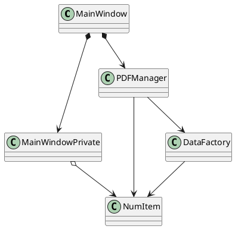

# Qt实战

## 自动生成计算试卷pdf打印文件。

自动生成惩罚试卷



```plantuml
@startuml
class MainWindow
class MainWindowPrivate
class NumItem
class PDFManager
class DataFactory
MainWindow *--> MainWindowPrivate
MainWindow *--> PDFManager
MainWindowPrivate o--> NumItem
PDFManager --> NumItem
PDFManager --> DataFactory
DataFactory --> NumItem
@enduml
```


```plantuml
@startuml
draw -> draw:绘制标题信息
draw -> drawLine:
drawLine -> drawLine: 绘制题标，按行绘制
drawLine -> drawNum
drawNum -> drawNum: 绘制数字内容
 
@enduml
